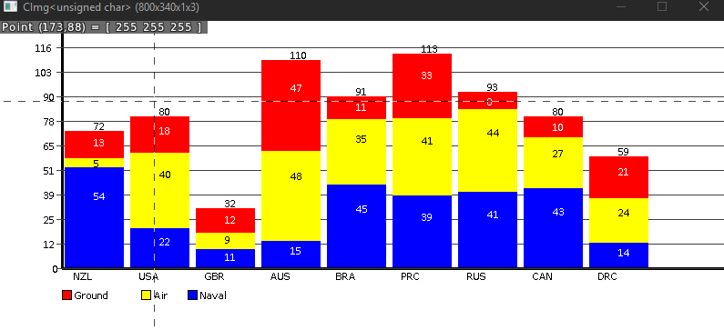
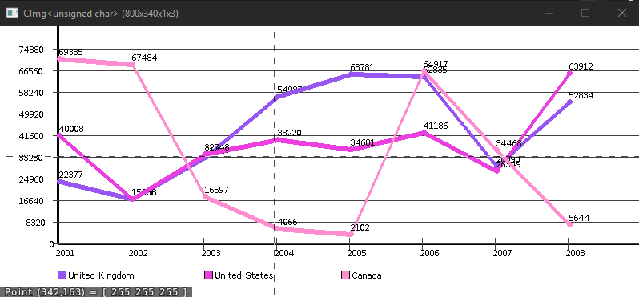

# FCharts
Very simple bar and line chart generator using CImg for drawing

Functionality is contained within ZCharter.h/cpp, main function is only for tests. Use it as reference
CImg does not belong to me: http://cimg.eu

Images: (last updated 15 June 2019)

